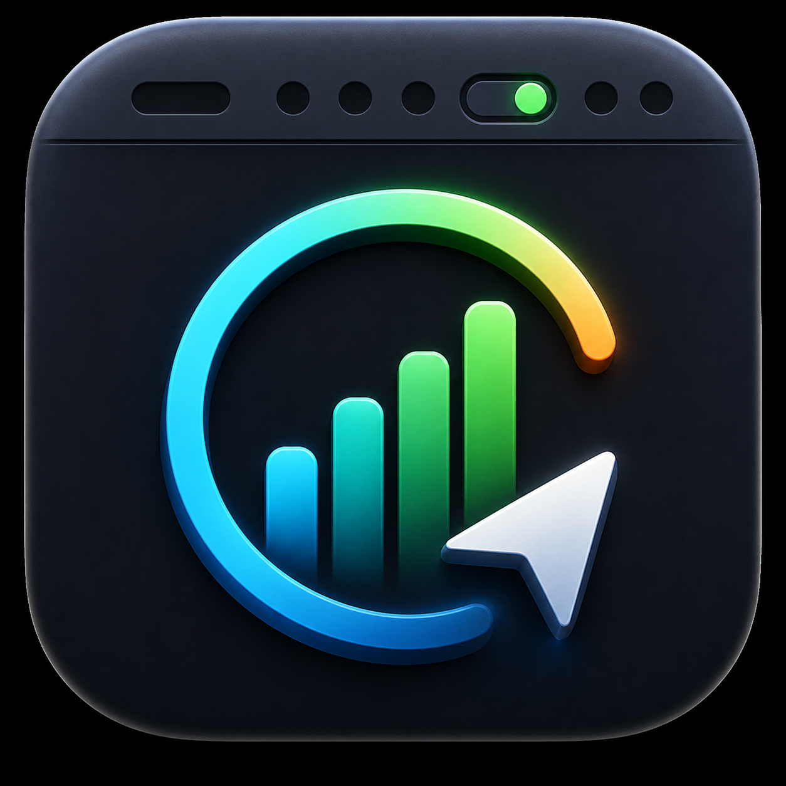

# AgentBar

AgentBar is a native macOS menu bar app for monitoring local AI coding agent usage signals. It focuses on Codex today, with safe Claude Code source detection that reports unavailable state instead of fabricating data.



## Features

- Menu bar usage indicator for the lowest remaining quota with a compact AgentBar status icon.
- Popover with multi-account Codex rows, full username display, 5-hour quota, and weekly quota.
- Automatic Codex account rotation when the current account runs low on 5-hour quota, with a safe restart guard that avoids restarting Codex while CLI work is active.
- Floating, non-activating HUD with edge snapping.
- Statistics window with today, yesterday, this week, this month, this year, 7-day, 30-day, all-time, and custom ranges.
- KPI cards, stacked usage bars, service mix, and model detail.
- Settings for language, refresh interval, login item, and menu bar display mode.
- Custom AgentBar app logo, app icon, and dedicated menu bar icon bundled as app resources.

## Data Sources

- Codex: reads `~/.codex/accounts/registry.json` and `~/.codex/sessions/**/*.jsonl` in read-only mode. Credential auth files are not opened.
- Claude Code: detects local Claude Code availability. If no `~/.claude` CLI usage source is found, AgentBar reports an unavailable live source rather than using mock data.
- Costs: local subscription sessions do not expose authoritative per-request cost. The UI shows `N/A` unless a real model-pricing table or authorized Admin API source is added.

## Build

```bash
swift test
swift build
./script/build_and_run.sh --verify
```

The app bundle is staged at `dist/AgentBar.app`.

## Package

```bash
./script/build_and_run.sh --package
ditto -c -k --norsrc --noextattr --keepParent dist/AgentBar.app dist/AgentBar-v1.0.0.zip
```

The local bundle is ad-hoc signed for development and local use. It is not notarized.

## Release

GitHub releases attach a zipped `.app` bundle:

- `AgentBar-v1.0.0.zip`

After unzipping, move `AgentBar.app` to `/Applications` or run it from the extracted folder.
