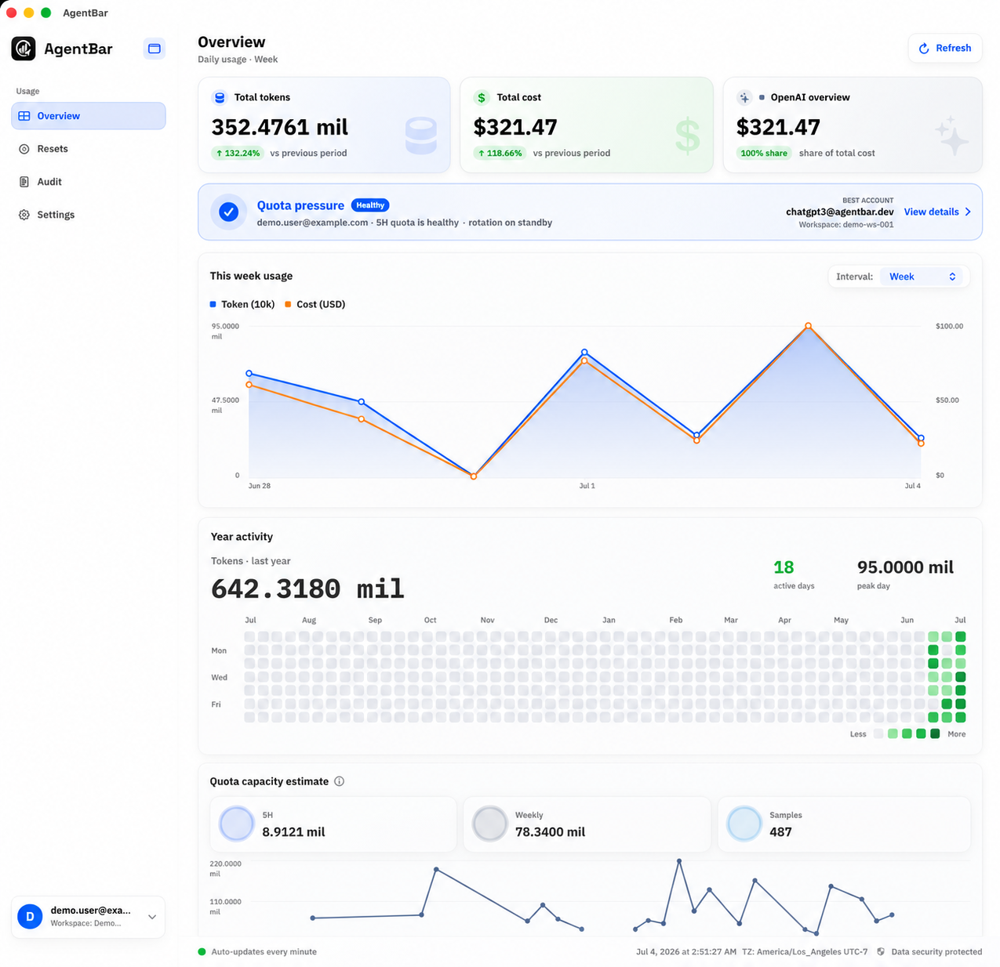
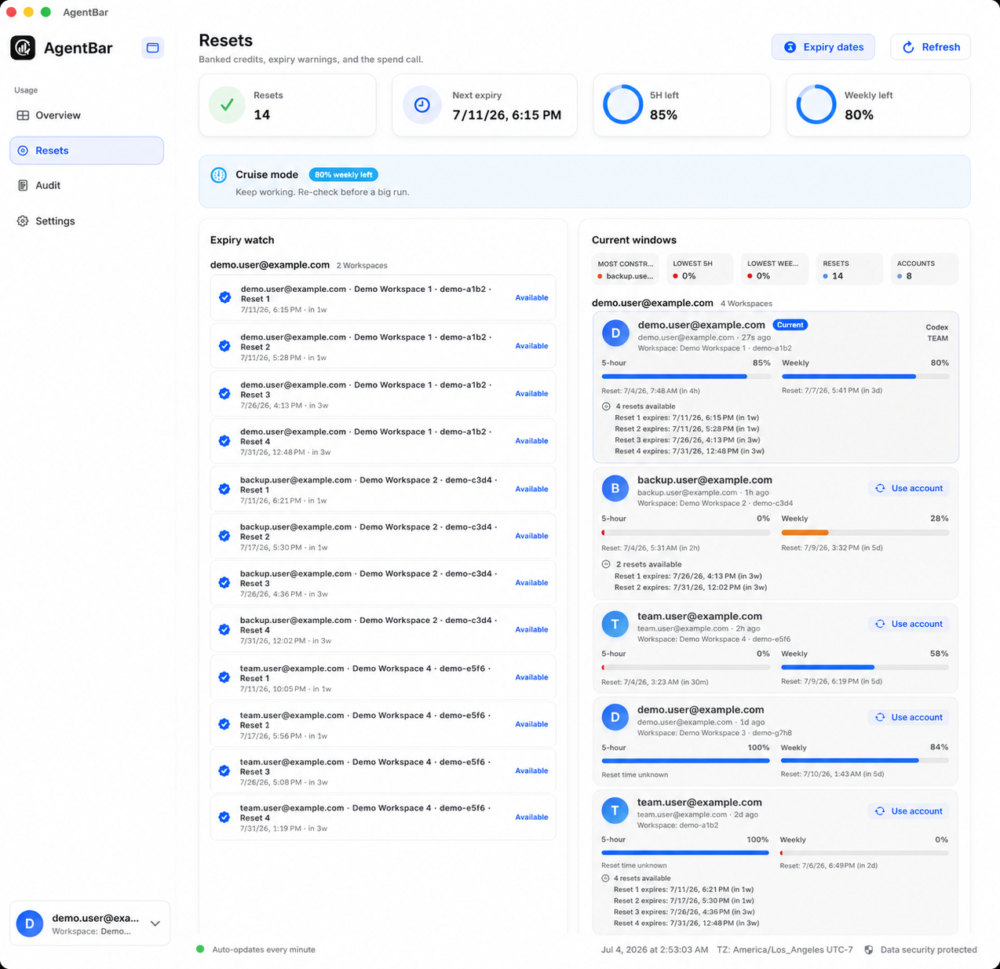
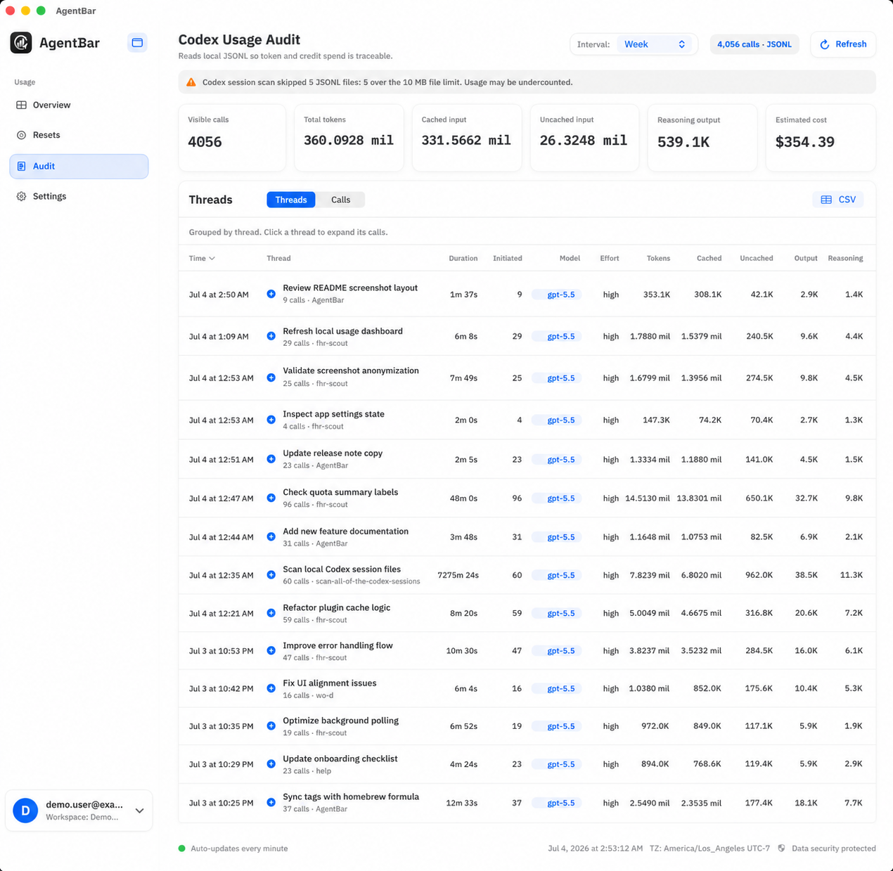
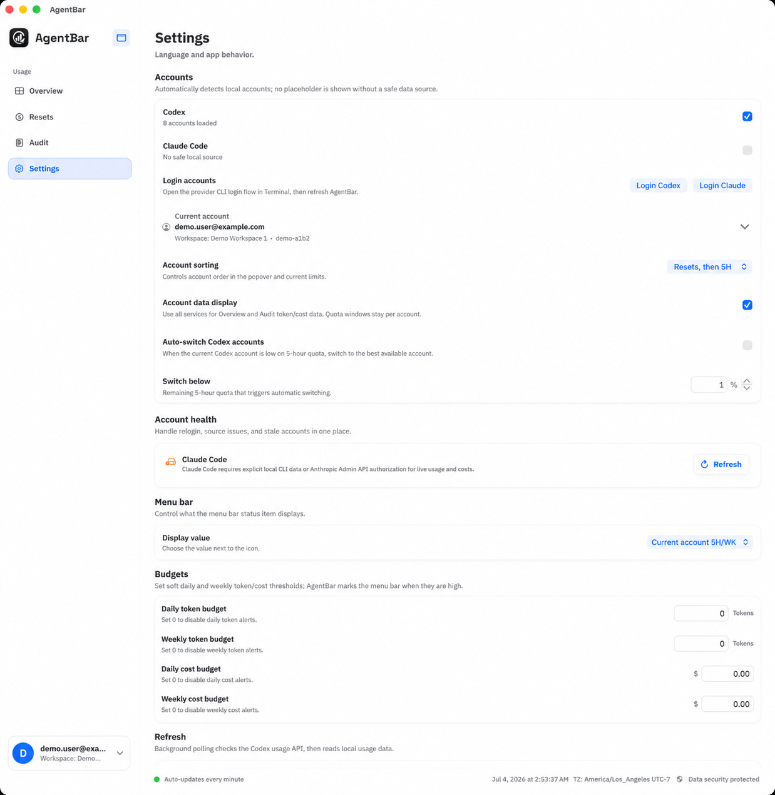
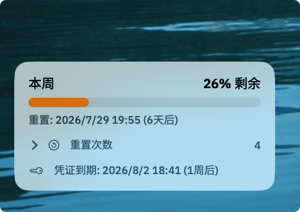

<h1> AgentBar</h1>

[](https://github.com/terrytan95/AgentBar/releases/latest)

[](https://github.com/terrytan95/homebrew-tap)

A native macOS menu bar companion for Codex usage, quotas, accounts, tasks, and local audits.

原生 macOS 菜单栏工具，用于查看 Codex 用量、额度、账户、任务与本地审计数据。

[English](#english) · [简体中文](#zh-cn) · [Install / 安装](#install--安装) · [Build / 构建](#build-from-source--从源码构建)

## Screenshots / 截图

<table>
  <tr>
    <td width="50%">
      
    </td>
    <td width="50%">
      
    </td>
  </tr>
  <tr>
    <td width="50%">
      
    </td>
    <td width="50%">
      
    </td>
  </tr>
  <tr>
    <td colspan="2" align="center">
      
    </td>
  </tr>
</table>

<a id="english"></a>

## English

AgentBar turns the usage data already available on your Mac into a compact menu bar view and a detailed dashboard. Codex is the primary live data source; Claude Code is detected safely and shown as unavailable when no authorized usage source exists.

### Highlights

- **Menu bar at a glance:** show the active account's 5-hour and weekly windows, the lowest remaining quota, total tokens, or Codex-only remaining quota. The popover is vertically resizable.
- **Codex accounts:** view, sort, switch, add, remove, and recover local accounts. Optional automatic rotation switches away from a low-quota account while avoiding a Codex restart during active CLI work.
- **Quota visibility:** track 5-hour and weekly windows, reset times, reset credits, quota pressure, capacity history, and access-token expiry.
- **Codex sidebar widget:** attach a quota card to the Codex sidebar or use it as an independent floating panel. See the active quota window's remaining percentage, progress, exact reset time and countdown, reset credits, and access-token expiry at a glance. The widget supports edge snapping, resizing, and a configurable global shortcut.
- **Usage dashboard:** inspect tokens, estimated cost, service/model breakdowns, activity charts, and comparisons for today, yesterday, this week, this month, this year, rolling 7/30 days, all time, or a custom range.
- **Live Task Center:** follow working, waiting, completed, and interrupted Codex tasks with repository, elapsed time, and token totals.
- **Projects and budgets:** group usage by repository, review model and cost trends, and set daily or weekly token/cost budgets globally or per project.
- **Local audit:** review threads and tasks by model, reasoning effort, time to first token, duration, throughput, token breakdown, and estimated cost. Export aggregate CSV or JSON reports.
- **Notifications:** opt in to quota-reset, task-completion, and Codex access-token expiry notifications.
- **Native preferences:** English and Simplified Chinese, system or dark appearance, launch at login, configurable refresh intervals, and built-in verified updates from GitHub Releases.

### Data sources and privacy

AgentBar has no separate analytics backend. Network access is limited to the ChatGPT usage endpoints for the active Codex account and GitHub for update checks and downloads.

- `~/.codex/sessions/**/*.jsonl` supplies local usage, task, model, token, and performance records. Source session files are not modified.
- `~/.codex/accounts/registry.json`, `~/.codex/auth.json`, and per-account auth snapshots supply account identity, quota state, authentication health, and credential expiry. Token contents are used only when required for quota sync or account actions and are not retained in AgentBar reports.
- Quota refresh and account-management actions can update Codex's local registry and auth snapshots. Parsed session metrics are cached under `~/Library/Caches/AgentBar/` for faster refreshes.
- Audit exports contain aggregate metrics and derived thread labels, not full prompts, replies, or tool output.
- Claude Code live usage and cost remain unavailable until an explicit supported local source or authorized Anthropic API source is provided; AgentBar does not fabricate fallback data.

### Requirements

- macOS 14 Sonoma or later
- A local Codex installation and login for Codex account/quota features
- Accessibility permission only when attaching the quota widget to the Codex window; independent floating mode does not require it

### Getting started

1. Sign in to Codex with `codex login` if needed.
2. Install and open AgentBar.
3. Click the menu bar item to review accounts and quota windows.
4. Open **Settings** to choose a language, display mode, refresh interval, notifications, budgets, or the Codex sidebar widget.

<a id="zh-cn"></a>

## 简体中文

AgentBar 将 Mac 上已有的用量数据整理为简洁的菜单栏视图和完整仪表盘。Codex 是当前主要的实时数据源；如果没有经过授权的用量来源，Claude Code 会明确显示为不可用，不会使用模拟数据。

### 主要功能

- **菜单栏概览：** 可显示当前账户的 5 小时与每周额度、最低剩余额度、Token 总量，或仅显示 Codex 剩余额度；弹窗支持垂直调整大小。
- **Codex 多账户：** 查看、排序、切换、添加、移除和恢复本地账户。可选的自动轮换会在当前账户额度偏低时切换账户，并在 CLI 任务运行期间避免重启 Codex。
- **额度追踪：** 查看 5 小时与每周额度窗口、重置时间、重置额度、额度压力、容量历史，以及访问令牌到期时间。
- **Codex 侧边栏小组件：** 将额度卡片附加到 Codex 侧边栏，或作为独立悬浮面板使用；可一眼查看当前额度窗口的剩余百分比、进度、准确重置时间与倒计时、重置额度，以及访问令牌到期时间，并支持贴边、调整大小和自定义全局快捷键。
- **用量仪表盘：** 查看 Token、预估费用、服务与模型分布、活动图表和区间对比；支持今天、昨天、本周、本月、本年、近 7/30 天、全部和自定义日期范围。
- **实时任务中心：** 跟踪工作中、等待中、已完成和已中断的 Codex 任务，并查看仓库、耗时与 Token 总量。
- **项目与预算：** 按仓库汇总用量，查看模型和费用趋势，并设置全局或单项目的每日/每周 Token 与费用预算。
- **本地审计：** 按线程和任务查看模型、推理强度、首 Token 延迟、耗时、吞吐量、Token 明细和预估费用；支持导出聚合后的 CSV 或 JSON 报告。
- **通知：** 可选择开启额度重置、任务完成和 Codex 访问令牌到期通知。
- **原生设置：** 支持英文与简体中文、跟随系统或深色外观、登录时启动、自定义刷新间隔，以及来自 GitHub Releases 的内置校验更新。

### 数据来源与隐私

AgentBar 没有独立的分析后端。网络访问仅用于通过当前 Codex 账户请求 ChatGPT 用量接口，以及通过 GitHub 检查和下载更新。

- `~/.codex/sessions/**/*.jsonl` 提供本地用量、任务、模型、Token 与性能记录；AgentBar 不会修改这些会话源文件。
- `~/.codex/accounts/registry.json`、`~/.codex/auth.json` 和各账户的认证快照用于识别账户、读取额度状态、认证健康状态与凭证到期时间。Token 内容只在同步额度或执行账户操作时使用，不会写入 AgentBar 报告。
- 额度刷新和账户管理操作可能更新 Codex 的本地注册表与认证快照。解析后的会话指标会缓存在 `~/Library/Caches/AgentBar/`，用于加快后续刷新。
- 审计导出仅包含聚合指标和派生的线程标题，不包含完整 prompt、回复或工具输出。
- 在提供明确支持的本地来源或经过授权的 Anthropic API 来源之前，Claude Code 的实时用量与费用会显示为不可用；AgentBar 不会生成虚假的替代数据。

### 系统要求

- macOS 14 Sonoma 或更高版本
- 如需使用 Codex 账户与额度功能，需要已在本机安装并登录 Codex
- 只有将额度小组件附加到 Codex 窗口时才需要“辅助功能”权限；独立悬浮模式不需要

### 快速开始

1. 如尚未登录，运行 `codex login`。
2. 安装并打开 AgentBar。
3. 点击菜单栏图标，查看账户与额度窗口。
4. 打开**设置**，调整语言、显示模式、刷新间隔、通知、预算或 Codex 侧边栏小组件。

## Install / 安装

### Homebrew (recommended / 推荐)

```bash
brew install --cask terrytan95/tap/agentbar
```

Upgrade later with / 后续升级：

```bash
brew upgrade --cask agentbar
```

### Manual download / 手动下载

Download the latest archive from [GitHub Releases](https://github.com/terrytan95/AgentBar/releases/latest), unzip it, and move `AgentBar.app` to `/Applications`.

从 [GitHub Releases](https://github.com/terrytan95/AgentBar/releases/latest) 下载最新压缩包，解压后将 `AgentBar.app` 移至 `/Applications`。

## Build from source / 从源码构建

Requirements: Xcode Command Line Tools with Swift 6.1 or later.

需要安装包含 Swift 6.1 或更高版本的 Xcode Command Line Tools。

```bash
git clone https://github.com/terrytan95/AgentBar.git
cd AgentBar
swift test
./script/build_and_run.sh --verify
```

The verified development app is staged under the system temporary directory. To create `dist/AgentBar.app`, use `./script/build_and_run.sh --package`; packaging requires a stable code-signing identity unless explicitly enabled for a throwaway local build.

验证后的开发版 App 会生成在系统临时目录。若要创建 `dist/AgentBar.app`，请运行 `./script/build_and_run.sh --package`；除非明确启用仅供临时使用的本地构建，否则打包需要稳定的代码签名身份。

## Feedback / 反馈

Found a bug or have a focused feature request? Open a [GitHub Issue](https://github.com/terrytan95/AgentBar/issues).

如果发现问题或有明确的功能建议，请提交 [GitHub Issue](https://github.com/terrytan95/AgentBar/issues)。
