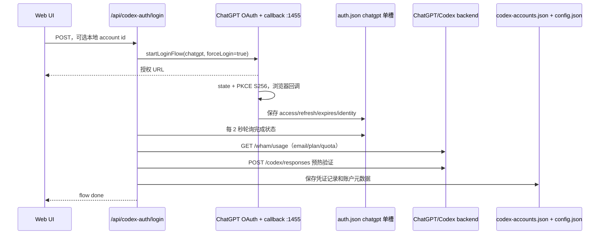

# OpenCodex 多 ChatGPT 账户登录与状态维护

## 调研范围

本文只分析 `lidge-jun/opencodex` 当前源码中的 **OpenAI / ChatGPT（Codex 登录）账户池**，不把
Anthropic、xAI、Kimi 等 provider 的通用 OAuth 多账户功能混为一谈。

- 源码快照：[`3f0481937a6f7856c8a35de99b459078ed9b9e1e`][commit]
- 调研日期：2026-07-19（America/Los_Angeles）
- 证据优先级：固定 commit 的源码 > 同 commit 的仓库文档 > 本文推断

## 结论

OpenCodex 没有让 Codex 客户端本身同时登录多个账户。它把 Codex 的请求代理到本地 Bun
进程，在代理层选择一个 ChatGPT bearer token，再覆盖发往 ChatGPT Codex 后端的
`Authorization` 和 `ChatGPT-Account-Id`。Pool 模式下，主账户与额外账户共同进入选择器；
Direct 模式则完全绕过账户池，继续使用 caller 传入的主登录 bearer。[认证上下文][auth-context]
[请求头覆盖][forward-adapter]

账户状态分成两个层次：

1. **主账户**仍由 Codex CLI / App 的 `$CODEX_HOME/auth.json` 管理。OpenCodex 每次读取但不导入、
   不写入、也不刷新它；JWT 可解码时会检查 `exp`。[主账户][main-account]
2. **额外账户**由 OpenCodex 的 `~/.opencodex/codex-accounts.json`（或
   `$OPENCODEX_HOME/codex-accounts.json`）保存完整 access/refresh token、过期时间和
   ChatGPT account id；`config.json` 只保存账户元数据、活动账户与切换阈值。[账户记录类型][account-types]
   [凭证存储][account-store]

新增账户采用 ChatGPT OAuth Authorization Code + PKCE。通用 `auth.json` 中的 `chatgpt` 项只是
登录过程的**单槽临时账本**；完成身份检查和真实 Codex 请求预热后，凭证会复制到独立的
`codex-accounts.json` 多账户账本。多账户能力真正位于后者，而不是通用 OAuth store。
[单槽说明][oauth-store]

## 一、账户模型与持久化

### 1. 主账户和额外账户是两种不同的所有权

主账户有固定逻辑 id `__main__`。源码明确选择“只读 Option A”：从 Codex 自己的
`auth.json` 读取 `access_token` / `account_id`，OpenCodex 不接管 refresh token；主 token 过期后
要求用户通过 Codex CLI / App 重新登录。[主账户][main-account]

额外账户则拆成两份数据：

| 位置 | 内容 | 持久化 |
| --- | --- | --- |
| `$CODEX_HOME/auth.json` | Codex 主账户 token | 由 Codex 管理，OpenCodex 只读 |
| `$OPENCODEX_HOME/config.json` | `codexAccounts[]` 的 id、email、plan、非 PII log label；`activeCodexAccountId`、切换阈值 | 是 |
| `$OPENCODEX_HOME/codex-accounts.json` | 额外账户的 access token、refresh token、`expiresAt`、`chatgptAccountId`、generation、删除墓碑、最近预热结果 | 是 |
| `$OPENCODEX_HOME/auth.json` 的 `chatgpt` 单槽 | 最近一次 ChatGPT OAuth 登录的通用凭证副本，供添加账户流程取回 | 是，但不是账户池账本 |
| Bun 进程内 Map / Set | thread affinity、quota、cooldown、失败计数、needs-reauth | 否，重启即丢失 |

`OPENCODEX_HOME` 未设置时默认是 `~/.opencodex`。[目录解析][config-dir] 额外凭证记录采用
`generation` 做乐观并发控制；删除不是直接移除键，而是写入无 token 的 tombstone 并递增
generation，防止删除期间的旧 refresh 结果把账户复活。[凭证记录][account-record]

### 2. 磁盘写入与坏文件恢复

账户文件在 POSIX 上以目录 `0700`、文件 `0600` 写入，采用临时文件 + rename 的原子写；
Windows 还尝试移除继承和宽泛 ACL，仅授权当前用户。损坏 JSON 会先复制为
`.invalid-<timestamp>` 再按空 store 处理。[权限与原子写][atomic-write]
[账户文件读写][account-store-load] [Windows ACL][windows-acl]

**源码事实与推断：** token 以明文 JSON 保存在用户目录，没有 Keychain、系统凭证库或应用层加密。
这里的机密性边界是本机用户权限/ACL。`chatgpt` scratch slot 在成功复制到
`codex-accounts.json` 后没有清理步骤，因此最近新增的账户凭证通常会在两个 OpenCodex 文件中
各有一份。[OAuth 写入][run-login] [池复制][codex-login-copy]

## 二、添加一个 ChatGPT 账户的完整调用链

### 1. 发起 OAuth

`POST /api/codex-auth/login` 校验本地账户 id（字符白名单、最长 64），拒绝同 id，然后调用
`startLoginFlow("chatgpt", { forceLogin: true })`。`forceLogin` 会在授权 URL 加
`prompt=login`，避免浏览器静默复用现有会话，从而允许选择另一个 ChatGPT 账户。
[登录 API][codex-login-api] [ChatGPT OAuth][chatgpt-oauth]

ChatGPT flow 使用：

- `https://auth.openai.com/oauth/authorize` / `oauth/token`；
- Authorization Code + PKCE S256；
- `openid profile email offline_access ...` scope；
- 固定 redirect URI `http://localhost:1455/auth/callback`；
- 128-bit 随机 `state` 防 CSRF；
- 300 秒 callback timeout。

callback listener 实际绑定 IPv4 loopback，并在可用时同时绑定 `::1`；固定 redirect URI 意味着
1455 被占用时不能换随机端口。GUI/SSH 还允许粘贴 redirect URL 或原始 code；URL/query 形式必须
携带匹配 state，原始 code 仍受当前 PKCE verifier 约束。[Callback 安全][callback-server]
[手动回调校验][manual-callback]

同一 provider 同时只允许一个 OAuth flow；第二个 ChatGPT 添加操作会收到 409 “already in
progress”。取消操作会 abort 当前 flow。[登录并发门][login-guard]

### 2. 身份、重复检测与预热

token exchange 后，代码优先从 `id_token`、再从 `access_token` 的 JWT payload 取
`chatgpt_account_id`，其次查看 namespaced claim 或第一个 organization；email 同样从 JWT 读取。
[身份提取][chatgpt-identity]

随后添加流程最多轮询 150 次、每次 2 秒，从 `chatgpt` scratch slot 取回凭证；再尽力调用
`/backend-api/wham/usage` 获取 email、plan 和 quota。重复检查只在“个人 / workspace”各自 bucket
内部比较 ChatGPT account id + email；它不拿额外账户与主账户去重。[登录落库链][codex-login-copy]
[重复规则][collision]

保存前必须向 `https://chatgpt.com/backend-api/codex/responses` 发一个小型 streaming 请求，看到
`response.completed` 才通过；默认用 `gpt-5.4-mini`，HTTP 400 时改试 `gpt-5.5`。失败响应只提取
结构化、截断后的错误字段，不回显任意原始正文。[预热验证][warmup]

只有身份、重复检查和预热全部成功，才把完整凭证写入 `codex-accounts.json`，把账户元数据写进
`config.json`，并清除该账户的 needs-reauth 标记。[登录落库链][codex-login-copy]

## 三、token 过期检测与刷新

### 1. 额外账户：请求前惰性刷新

每次 Pool 请求解析出账户后调用 `getValidCodexToken(id)`。若 `expiresAt` 比当前时间至少晚 60 秒，
直接复用 access token；否则向 OpenAI token endpoint 提交 refresh grant，30 秒超时。成功后保存
新的 access token、服务端可能轮换的新 refresh token 和新的 `expiresAt`；若响应没有新 refresh
token，则保留旧值。[刷新主链][account-refresh]

刷新错误被归类为 `revoked`、`expired` 或 `unknown`，向上只抛“需要重新认证”的净化错误，避免把
refresh token、账户别名或上游 error description 暴露给 API/日志。认证上下文捕获失败后把账户
加入进程内 needs-reauth Set；generation conflict 和 file-lock timeout 被视为并发问题，不错误地
隔离账户。[刷新错误][refresh-error] [认证失败处理][auth-failure]

### 2. 刷新并发控制

刷新以 refresh grant 的 SHA-256 fingerprint 为 key，而不是以本地账户别名为 key：

- 同进程 `Map<fingerprint, Promise>` 合并并发 refresh；
- 跨进程使用 `open(..., "wx")` 的 `0600` lock file，50 ms 轮询，60 秒判 stale、65 秒总等待；
- 拿锁后重新读取磁盘，避免等待期间另一个进程已经刷新；
- 同一 refresh grant 若被多个本地 id 引用，可直接复用另一个 id 已刷新的凭证；
- 写回使用 generation compare-and-swap，账户被替换或删除后拒绝旧结果。

这套机制同时处理 refresh-token rotation 和“删除/重新登录与 refresh 并发”的竞态。
[刷新锁][refresh-lock] [刷新 CAS][account-refresh]

### 3. 主账户与可选 Token Guardian

主账户没有上述 refresh：OpenCodex 只看 `$CODEX_HOME/auth.json` 当前 access token，JWT 已过期就
不可用；无法解码 `exp` 时先视为可用，让上游 401 再触发隔离。[主账户][main-account]

额外账户默认也是**请求前惰性刷新**。后台 Token Guardian 默认关闭；只有全局
`tokenGuardian.enabled` 开启、OpenAI provider 的 refresh policy 解析为 `proactive` 时，它才按
默认 6 小时 cadence（加 jitter）检查账户是否将在“下一 tick + lead”内过期，并复用同一套
`getValidCodexToken()` 刷新。可选 warmup 还能周期性重新验证 Codex 权限；失败按指数退避，永久
refresh 失败直接使用最大退避。[Guardian 策略][guardian]

## 四、每个请求如何选择和注入账户

### 1. Pool 与 Direct

canonical `openai` provider 支持两种模式：

- `pool`（未配置时的默认）：主账户 + 额外账户进入 affinity / quota / cooldown / failover 引擎；
- `direct`：要求 caller 自带 bearer，完全绕过 pool 状态。

OpenAI API key 使用单独 provider，不会和 ChatGPT 登录互相 fallback。[模式定义][provider-mode]

Responses 请求到达后，server 先解析 `x-codex-parent-thread-id`，选择账户，取得/刷新 token，
检查 cooldown 和 generation，再把 runtime-only `_codexAccountOverride` 写入 provider。adapter 只转发
一组明确 allowlist headers，最后用所选账户覆盖 `authorization` 与 `chatgpt-account-id`。
[请求认证链][responses-auth] [认证上下文][auth-context] [请求头覆盖][forward-adapter]

**源码推断：** 如果客户端没有发送 `x-codex-parent-thread-id`，OpenCodex 无法建立线程 affinity，
每个请求只会使用当时的 active/自动选择结果。[认证上下文][auth-context]

### 2. 新请求的选择分数

可选账户必须：存在凭证、未标记 needs-reauth、未处于 cooldown；主账户还必须有未过期 token。
选择器给未知 quota 记 100 分，普通 plan 取已知 weekly / monthly 中最高使用率，Go / Free 只看
monthly；分数最低者优先。`activeCodexAccountId` 会写回 `config.json`，所以“下一个账户”跨重启保留。
[可选账户与分数][routing-score]

自动切换默认阈值 80。active 超过阈值时选严格更低的账户；所有 quota 都未知时，会按配置顺序在
未知候选间轮换，避免永远卡在一个 100 分账户。启动时和首次路由发现 quota 缺失时，后台以最多
4 并发查询 `/wham/usage`，单账户结果缓存 5 分钟且不阻塞当前请求。[自动切换][auto-switch]
[quota prime][quota-prime] [启动 prime][startup-prime]

**当前源码与 README 不一致：** README 仍写“5 小时 / 每周 / 30 天”，但当前 quota 数据结构只有
weekly/monthly；parser 还明确注明 primary window “was the 5h window; it now carries weekly data”。
因此当前 commit 的路由分数没有独立 5h 维度。[README 宣传][readme-pool]
[当前 quota parser][quota-parser]

## 五、thread affinity、切换和 failover

### 1. “现有线程固定”不是绝对保证

affinity 是 `thread id -> { accountId, generation, createdAt, lastUsedAt, lastReevalAt }` 的进程内 Map，
最多 2048 条，按 24 小时 idle TTL 清理。凭证 generation 变化、账户不可用或 cooldown 会使映射
失效。[Affinity 数据结构][routing-affinity]

README 的“existing threads stay pinned”只描述常态，源码有四个明确例外：

1. 每 60 秒重新评估一次已绑定线程的 quota；若越过阈值且存在更低用量账户，**同一 thread id 会被
   主动 rebind**。[定期重绑][affinity-reeval]
2. 上游 401 / 403 会标记 needs-reauth 并清除该账户的全部 affinity。[认证隔离][outcome-handling]
3. 上游 429 会设置 cooldown、清除 affinity，并立刻把全局 active 切到其他可用账户。
   [配额隔离][outcome-handling]
4. affinity 24 小时未使用后不会静默换账户，而是让当前请求得到 409，要求开新 session。
   [过期处理][responses-auth]

此外，这个 Map 不落盘，所以 OpenCodex 重启后原有 thread 的绑定也不存在。README 的“不会在
对话中途跳账户”不应被理解为跨重启、跨 24h idle、跨 quota/auth 事件的硬保证。

### 2. 失败分类与恢复语义

上游结果被分为：2xx success；401/403 credential；429 quota；其他 4xx caller；5xx、连接错误和
timeout transient。caller 4xx 不惩罚账户；success 清 transient streak，但不提前清尚未到期的
cooldown；transient 默认 5 分钟窗口内连续 3 次后为未来请求切换账户。[结果分类][outcome-class]
[结果处理][outcome-handling]

429 cooldown 优先取 `Retry-After`，其次取 Codex reset header，最后默认 60 秒，最长夹到 24 小时。
[cooldown 计算][cooldown]

**源码事实：ChatGPT Pool 不会拿另一个账户透明重放当前失败请求。** forward/OAuth provider 被
明确排除在同请求的 multi-key 429 retry loop 外；当前响应仍返回失败，账户池状态用于下一轮/下一
请求重新选择。瞬时 5xx 在拿到响应头之前有独立的同账户 transient retry，但那不是跨账户重放。
[同请求重试边界][same-request-retry]

## 六、删除、重新登录与 WebSocket

删除账户时，代码依次写 tombstone、从 `config.codexAccounts` 移除、清 quota/reauth/affinity/health，
并关闭绑定该账户的 WebSocket（code 4001）。如果删的是 active，持久化 active id 会清空，让下次
选择器重新决定。[删除链][account-delete] [WebSocket 失效][websocket-invalidate]

WebSocket 只在连接对象上保留最近一次 auth context；每个 turn 的请求仍重新解析认证，使 token
刷新或账户变化能进入新 turn。删除时 registry 按账户找到并中止相关 socket。
[WebSocket 上下文][websocket-registry]

## 七、安全边界

- OAuth 使用 PKCE + state，callback 仅监听 loopback；手工粘贴 URL/query 也校验 state。
  [Callback 安全][callback-server]
- token 不出现在账户列表响应；email 会 mask，日志使用随机 `p` + 6 hex label 而不是邮箱/id。
  [账户 DTO][account-dto] [日志 label][account-label]
- refresh 和 warmup 错误面向用户时做净化；非 JSON warmup body 不回显。
  [刷新错误][refresh-error] [预热验证][warmup]
- server 绑定非 loopback 时强制设置 `OPENCODEX_API_AUTH_TOKEN`，并为 data plane / management API
  校验专用 admission secret；远端 Responses 请求必须用独立的 `x-opencodex-api-key`，避免把代理
  admission bearer 误转发到 OpenAI。[远端绑定保护][remote-auth]
- 磁盘 token 仍是明文；`0600` / `0700` / Windows ACL 是唯一 at-rest 防线。
  [权限与原子写][atomic-write]

## 八、实现上的重要限制与推断

以下结论是对源码结构的推断，仓库没有把它们都写成产品保证：

1. **单进程是完整状态一致性的实际边界。** 仓库文档说明服务运行于单个 Bun 进程；refresh grant
   有跨进程文件锁，但 affinity、quota、cooldown、失败计数、needs-reauth 和 Guardian backoff 都只在
   内存。并行运行多个 OpenCodex 实例不会共享完整路由状态。[架构说明][architecture]
2. **重启会“记住 active，不记住原因”。** 账户凭证和 active id 持久化，但 quota、health、cooldown、
   reauth、thread affinity 会丢失；启动 prime 会重建部分 quota，其余状态只能由后续请求重新学习。
3. **主账户生命周期依赖 Codex。** OpenCodex 没有主账户 refresh token，主登录失效只能回 Codex
   重新认证；额外账户才是 OpenCodex 自维护 token 的对象。[主账户][main-account]
4. **“固定线程”和“5h quota”两句 README 文案都比当前实现更绝对。** 当前实现会周期重绑、失败
   清 affinity，且已没有独立 5h 分数；集成时应以 `routing.ts` / `quota.ts` 为准。
5. **账户池的 failover 是后续请求语义，不是当前请求 exactly-once 重放。** 这样避免代理在不确定
   上游是否已接收请求时跨账户重复执行，但调用方需要处理当前 401/429/5xx。

## 可迁移到 AgentBar 的核心思路

如果 AgentBar 只是需要读取/展示多个 Codex 登录状态，最值得借鉴的不是整套 proxy，而是四个边界：

1. 主 Codex 账户保持只读，额外账户使用独立的 managed credential ledger；
2. refresh token rotation 必须先落盘，再让请求使用新 access token，并配 generation/tombstone；
3. “凭证持久态”与“quota/cooldown/affinity 运行态”分开建模；
4. UI 文案要明确 affinity 的 TTL、重启和认证/配额失效例外，不能只写“线程固定”。

这不是建议 AgentBar 直接复制 OpenCodex 的明文 token 文件或浏览器 OAuth client；是否接管 ChatGPT
refresh token、是否符合 OpenAI 客户端授权边界，需要单独做产品与安全决策。

[commit]: https://github.com/lidge-jun/opencodex/tree/3f0481937a6f7856c8a35de99b459078ed9b9e1e
[readme-pool]: https://github.com/lidge-jun/opencodex/blob/3f0481937a6f7856c8a35de99b459078ed9b9e1e/README.zh-CN.md#L32-L55
[architecture]: https://github.com/lidge-jun/opencodex/blob/3f0481937a6f7856c8a35de99b459078ed9b9e1e/docs-site/src/content/docs/zh-cn/reference/architecture.md#L5-L24
[account-types]: https://github.com/lidge-jun/opencodex/blob/3f0481937a6f7856c8a35de99b459078ed9b9e1e/src/types.ts#L763-L788
[provider-mode]: https://github.com/lidge-jun/opencodex/blob/3f0481937a6f7856c8a35de99b459078ed9b9e1e/src/types.ts#L583-L635
[config-dir]: https://github.com/lidge-jun/opencodex/blob/3f0481937a6f7856c8a35de99b459078ed9b9e1e/src/config.ts#L255-L285
[atomic-write]: https://github.com/lidge-jun/opencodex/blob/3f0481937a6f7856c8a35de99b459078ed9b9e1e/src/config.ts#L42-L118
[windows-acl]: https://github.com/lidge-jun/opencodex/blob/3f0481937a6f7856c8a35de99b459078ed9b9e1e/src/lib/windows-secret-acl.ts#L142-L198
[account-store]: https://github.com/lidge-jun/opencodex/blob/3f0481937a6f7856c8a35de99b459078ed9b9e1e/src/codex/account-store.ts#L16-L27
[account-store-load]: https://github.com/lidge-jun/opencodex/blob/3f0481937a6f7856c8a35de99b459078ed9b9e1e/src/codex/account-store.ts#L79-L102
[account-record]: https://github.com/lidge-jun/opencodex/blob/3f0481937a6f7856c8a35de99b459078ed9b9e1e/src/codex/account-store.ts#L115-L209
[main-account]: https://github.com/lidge-jun/opencodex/blob/3f0481937a6f7856c8a35de99b459078ed9b9e1e/src/codex/main-account.ts#L4-L46
[oauth-store]: https://github.com/lidge-jun/opencodex/blob/3f0481937a6f7856c8a35de99b459078ed9b9e1e/src/oauth/store.ts#L1-L32
[run-login]: https://github.com/lidge-jun/opencodex/blob/3f0481937a6f7856c8a35de99b459078ed9b9e1e/src/oauth/index.ts#L449-L460
[chatgpt-oauth]: https://github.com/lidge-jun/opencodex/blob/3f0481937a6f7856c8a35de99b459078ed9b9e1e/src/oauth/chatgpt.ts#L5-L115
[chatgpt-identity]: https://github.com/lidge-jun/opencodex/blob/3f0481937a6f7856c8a35de99b459078ed9b9e1e/src/oauth/chatgpt.ts#L13-L58
[callback-server]: https://github.com/lidge-jun/opencodex/blob/3f0481937a6f7856c8a35de99b459078ed9b9e1e/src/oauth/callback-server.ts#L40-L259
[manual-callback]: https://github.com/lidge-jun/opencodex/blob/3f0481937a6f7856c8a35de99b459078ed9b9e1e/src/oauth/index.ts#L497-L554
[login-guard]: https://github.com/lidge-jun/opencodex/blob/3f0481937a6f7856c8a35de99b459078ed9b9e1e/src/oauth/index.ts#L587-L645
[codex-login-api]: https://github.com/lidge-jun/opencodex/blob/3f0481937a6f7856c8a35de99b459078ed9b9e1e/src/codex/auth-api.ts#L566-L603
[codex-login-copy]: https://github.com/lidge-jun/opencodex/blob/3f0481937a6f7856c8a35de99b459078ed9b9e1e/src/codex/auth-api.ts#L589-L696
[collision]: https://github.com/lidge-jun/opencodex/blob/3f0481937a6f7856c8a35de99b459078ed9b9e1e/src/codex/auth-collision.ts#L31-L59
[warmup]: https://github.com/lidge-jun/opencodex/blob/3f0481937a6f7856c8a35de99b459078ed9b9e1e/src/codex/warmup.ts#L28-L190
[account-refresh]: https://github.com/lidge-jun/opencodex/blob/3f0481937a6f7856c8a35de99b459078ed9b9e1e/src/codex/account-store.ts#L305-L435
[refresh-lock]: https://github.com/lidge-jun/opencodex/blob/3f0481937a6f7856c8a35de99b459078ed9b9e1e/src/codex/account-store.ts#L238-L303
[refresh-error]: https://github.com/lidge-jun/opencodex/blob/3f0481937a6f7856c8a35de99b459078ed9b9e1e/src/codex/account-store.ts#L390-L423
[auth-failure]: https://github.com/lidge-jun/opencodex/blob/3f0481937a6f7856c8a35de99b459078ed9b9e1e/src/codex/auth-context.ts#L88-L140
[guardian]: https://github.com/lidge-jun/opencodex/blob/3f0481937a6f7856c8a35de99b459078ed9b9e1e/src/oauth/token-guardian.ts#L43-L225
[auth-context]: https://github.com/lidge-jun/opencodex/blob/3f0481937a6f7856c8a35de99b459078ed9b9e1e/src/codex/auth-context.ts#L92-L181
[responses-auth]: https://github.com/lidge-jun/opencodex/blob/3f0481937a6f7856c8a35de99b459078ed9b9e1e/src/server/responses.ts#L912-L976
[forward-adapter]: https://github.com/lidge-jun/opencodex/blob/3f0481937a6f7856c8a35de99b459078ed9b9e1e/src/adapters/openai-responses.ts#L412-L461
[routing-score]: https://github.com/lidge-jun/opencodex/blob/3f0481937a6f7856c8a35de99b459078ed9b9e1e/src/codex/routing.ts#L214-L268
[auto-switch]: https://github.com/lidge-jun/opencodex/blob/3f0481937a6f7856c8a35de99b459078ed9b9e1e/src/codex/routing.ts#L270-L312
[quota-prime]: https://github.com/lidge-jun/opencodex/blob/3f0481937a6f7856c8a35de99b459078ed9b9e1e/src/codex/auth-api.ts#L301-L350
[startup-prime]: https://github.com/lidge-jun/opencodex/blob/3f0481937a6f7856c8a35de99b459078ed9b9e1e/src/server/index.ts#L616-L629
[quota-parser]: https://github.com/lidge-jun/opencodex/blob/3f0481937a6f7856c8a35de99b459078ed9b9e1e/src/codex/quota.ts#L102-L138
[routing-affinity]: https://github.com/lidge-jun/opencodex/blob/3f0481937a6f7856c8a35de99b459078ed9b9e1e/src/codex/routing.ts#L10-L42
[affinity-reeval]: https://github.com/lidge-jun/opencodex/blob/3f0481937a6f7856c8a35de99b459078ed9b9e1e/src/codex/routing.ts#L341-L410
[outcome-class]: https://github.com/lidge-jun/opencodex/blob/3f0481937a6f7856c8a35de99b459078ed9b9e1e/src/codex/routing.ts#L97-L105
[cooldown]: https://github.com/lidge-jun/opencodex/blob/3f0481937a6f7856c8a35de99b459078ed9b9e1e/src/codex/routing.ts#L108-L159
[outcome-handling]: https://github.com/lidge-jun/opencodex/blob/3f0481937a6f7856c8a35de99b459078ed9b9e1e/src/codex/routing.ts#L413-L467
[same-request-retry]: https://github.com/lidge-jun/opencodex/blob/3f0481937a6f7856c8a35de99b459078ed9b9e1e/src/server/responses.ts#L1390-L1488
[account-delete]: https://github.com/lidge-jun/opencodex/blob/3f0481937a6f7856c8a35de99b459078ed9b9e1e/src/codex/account-lifecycle.ts#L8-L21
[websocket-invalidate]: https://github.com/lidge-jun/opencodex/blob/3f0481937a6f7856c8a35de99b459078ed9b9e1e/src/codex/websocket-registry.ts#L47-L65
[websocket-registry]: https://github.com/lidge-jun/opencodex/blob/3f0481937a6f7856c8a35de99b459078ed9b9e1e/src/codex/websocket-registry.ts#L4-L45
[account-dto]: https://github.com/lidge-jun/opencodex/blob/3f0481937a6f7856c8a35de99b459078ed9b9e1e/src/codex/auth-api.ts#L71-L86
[account-label]: https://github.com/lidge-jun/opencodex/blob/3f0481937a6f7856c8a35de99b459078ed9b9e1e/src/codex/account-label.ts#L4-L33
[remote-auth]: https://github.com/lidge-jun/opencodex/blob/3f0481937a6f7856c8a35de99b459078ed9b9e1e/src/server/auth-cors.ts#L104-L182
